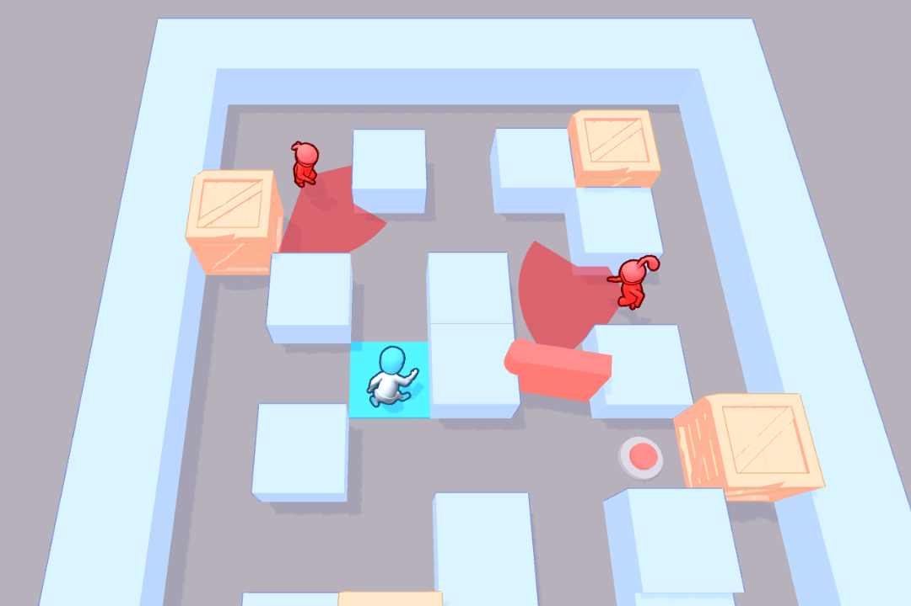

# Run and Hide Game

Hyper casual game created in unity and available on the Play Store. The main objective of the game is to paint all the floor tiles without getting caught by enemies.

### Implementation

The player moves when the user touches the screen and enemies have a range of vision that is impeded by obstacles. A pathfinder was used to move enemies when selecting random tiles as the destination.

### Links
Play Store - https://play.google.com/store/apps/details?id=com.MadRexGames.RunandHide
Video - https://www.youtube.com/shorts/y7vzE6fTMfY